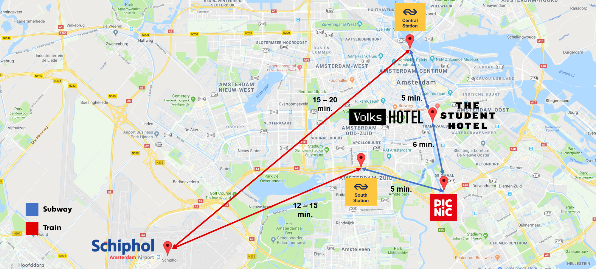

# Getting here 🛫

Whether you're dropping by for a coffee, have interviews, or are starting on your first day, knowing how to get here is important. The next few pictures give you a rough idea of how to get around using public transportation between the main destinations that will be relevant for you during your trip. Please bear in mind that although biking is the favorite method of transportation, this is not covered here. If you want to know how to get to the office by bike, you can use [Google Maps](https://www.google.com/maps) and enter the following address: **Van Marwijk Kooystraat 15, 1114 AG, Amsterdam**

### Amsterdam

### Public transport websites

## More

- [Picnic - An Introduction](Intro.md)
- [Tech Stack](Tech_Stack.md)
- [Picnic's Hiring Experience](Hiring_Process.md)
- [Onboarding](onboarding.md)
- [What you'll love about working @ Picnic](What_love_Picnic.md)
- [Still hungry?](hungry.md)